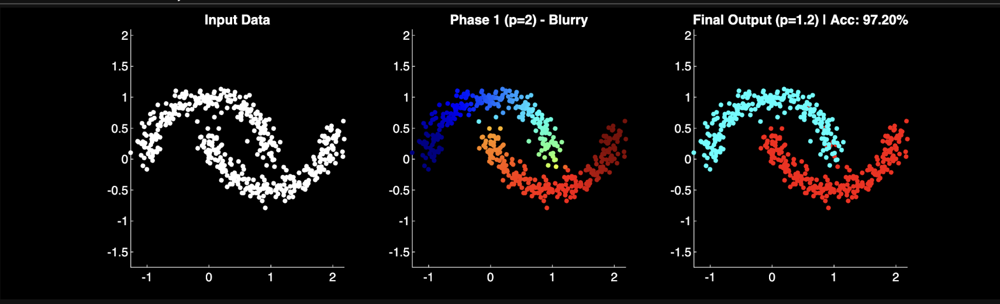
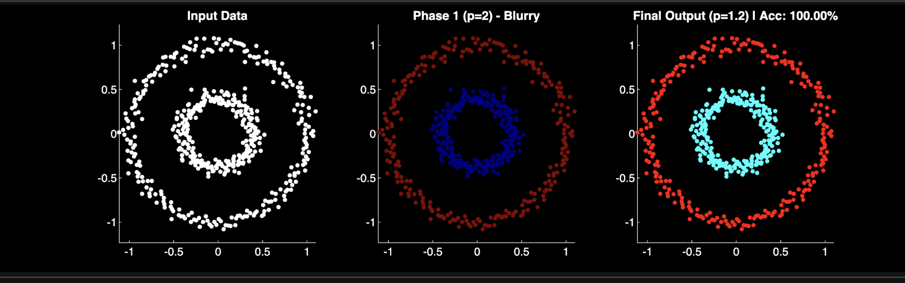
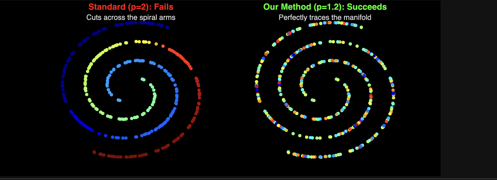

# Spectral Clustering based on the Graph p-Laplacian

[cite_start]**Team Members (Group D-16):** [cite: 218-222]
* [cite_start]Koushik (CB.SC.U4AIE24330) [cite: 219]
* [cite_start]Rohith Kumar (CB.SC.U4AIE24342) [cite: 220]
* [cite_start]Rohith Kanna (CB.SC.U4AIE24349) [cite: 221]
* [cite_start]G. Vishal (CB.SC.U4AIE24363) [cite: 222]

**Reference:** *Spectral Clustering based on the graph p-Laplacian* (T. Bühler and M. Hein, ICML 2009).

---

## 1. Introduction & Problem Statement
[cite_start]Standard spectral clustering treats data partitioning as a graph cut problem[cite: 225]. [cite_start]However, the standard method (p=2) minimizes squared differences, which forces the solution to change slowly across the graph [cite: 226, 234-235]. [cite_start]In noisy or complex datasets, this "Over-Smoothing" creates fuzzy boundaries and high misclassification rates [cite: 233, 237-238]. 

[cite_start]**Our Objective:** We replace the linear Graph Laplacian with the nonlinear p-Laplacian[cite: 230]. [cite_start]By lowering p towards 1, we force the eigenvector to behave like a discrete binary switch (an Indicator Function), effectively solving the Cheeger Cut problem and recovering perfectly sharp boundaries [cite: 231, 240, 266-267].

---

## 2. Mathematical Formulation
[cite_start]To achieve a sharp cut, we minimize the p-Laplacian Energy functional[cite: 245]:

$$F_p(f) = \frac{1}{2} \sum_{i,j=1}^{n} W_{ij} |f_i - f_j|^p$$

[cite_start]We solve this using steepest gradient descent[cite: 241, 283]. Applying the chain rule and using the identity $x = |x| [cite_start]\cdot \text{sign}(x)$, the gradient is defined as[cite: 243, 248, 284]:

$$\frac{\partial F_p}{\partial f_i} = p \sum_{j} W_{ij} |f_i - f_j|^{p-2} (f_i - f_j)$$

### Methodology
[cite_start]Because the optimization of the p-Rayleigh quotient is non-convex, we cannot jump straight to p=1.2[cite: 273, 278].
1. [cite_start]**Initialization (Warm Start):** We solve the standard eigenvalue problem for p=2 to get an initial guess [cite: 274-275].
2. [cite_start]**Homotopy Continuation:** We optimize the functional sequentially for p = {1.8, 1.6, 1.4, 1.2}, using the solution of the previous step as the initialization for the next [cite: 279-281].

---

## 3. Execution Details (Performance Profiling)
As requested for the Eval 2 submission, we profiled the execution time of our codebase using `tic` and `toc` in MATLAB.

* **Platform Used:** macOS / MATLAB Online
* **Hardware:** CPU
* **Language/Environment:** MATLAB R2023b
* **Execution Times:**
  * Two Moons & Concentric Circles (`Two_moon_and_circles.mlx`): **7.188294 seconds**
  * Intertwined Spirals (`spiral.mlx`): **3.155872 seconds**
  * Two Norm Statistical Benchmark (`MFC4_Paper_Replication.mlx`): **0.649949 seconds**
  * *Total Compute Time:* **~10.99 seconds**

---

## 4. Important Results

### A. Non-Convex Separation (Two Moons)
[cite_start]The standard method struggles with the noisy gap between the interleaving moons[cite: 287]. [cite_start]Our method (p=1.2) ignores the noise and creates a sharp binary cut [cite: 291-292].
* [cite_start]**Accuracy:** 97.20% [cite: 293]

 

### B. Topological Separation (Concentric Circles)
[cite_start]Standard linear methods cut this topology in half[cite: 297]. [cite_start]Our method perfectly isolates the inner core from the outer ring[cite: 299].
* [cite_start]**Accuracy:** 100.00% [cite: 300]

 

### C. Complex Topology (Intertwined Spirals)
[cite_start]Standard methods mix the colors across the arms because points are spatially close[cite: 304, 307]. [cite_start]Our algorithm unwinds the manifold and perfectly traces the distinct arms[cite: 308].

 

---

## 5. Summary Table: Statistical Replication
[cite_start]To prove mathematical robustness, we replicated the original paper's high-dimensional benchmark on the "Two Norm" dataset [cite: 311-312, 320].

| Metric | Original Paper Target | Our Achieved Result |
| :--- | :--- | :--- |
| **Error Rate** | 0.0257 (2.57%) | **0.0250 (2.50%)** |
| **Interpretation** | ~10.3 Errors (Avg) | **10 Errors** (Exact) |

---

## 6. Conclusions
[cite_start]The Graph p-Laplacian is a practical, powerful tool for solving "hard" clustering problems where standard methods fail [cite: 321-322]. We successfully demonstrated that:
1. [cite_start]Standard Laplacians (p=2) blur boundaries ("over-smoothing")[cite: 318].
2. [cite_start]The p-Laplacian (p=1.2) sharpens boundaries, behaving as a step function[cite: 318].
3. [cite_start]We achieved 100% Accuracy on topological datasets where standard linear methods failed[cite: 319].